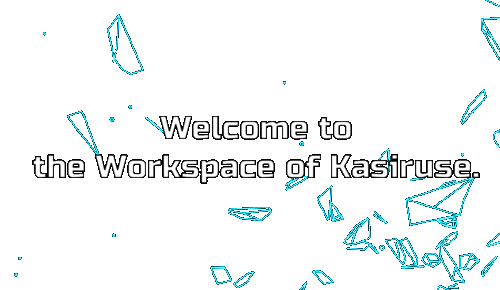
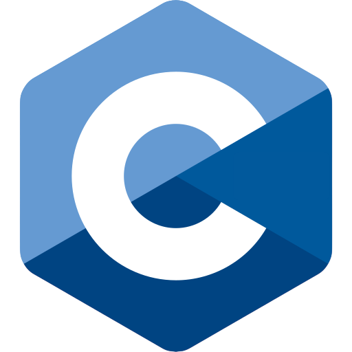
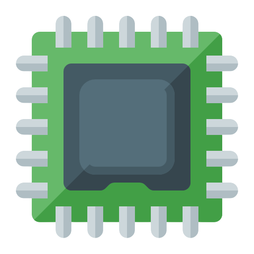
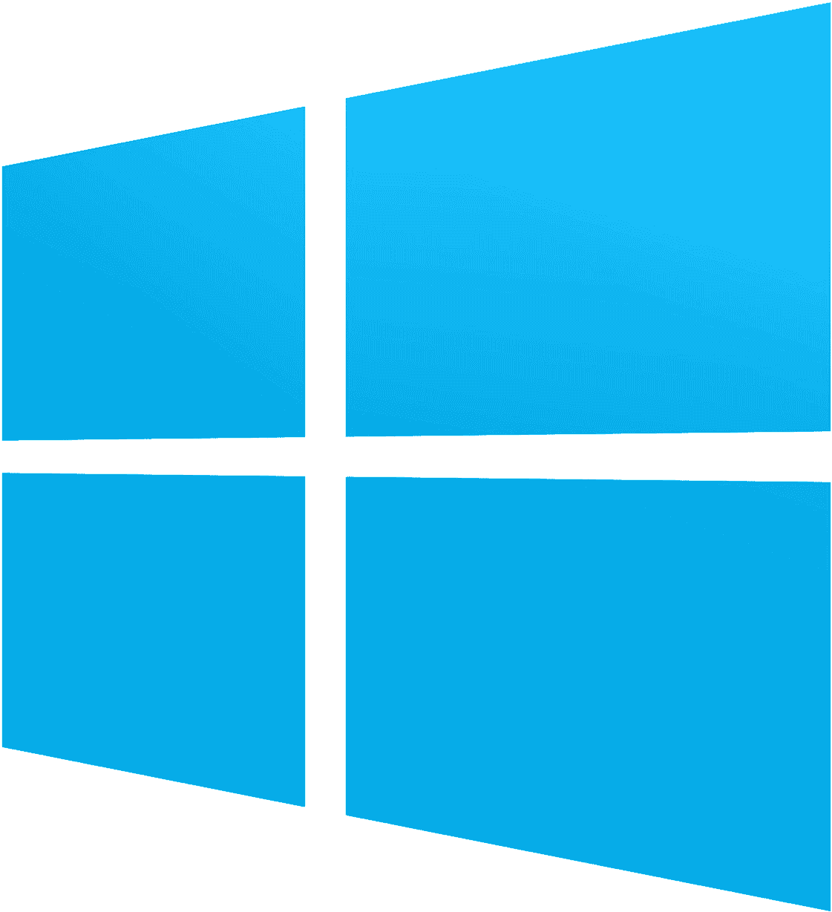
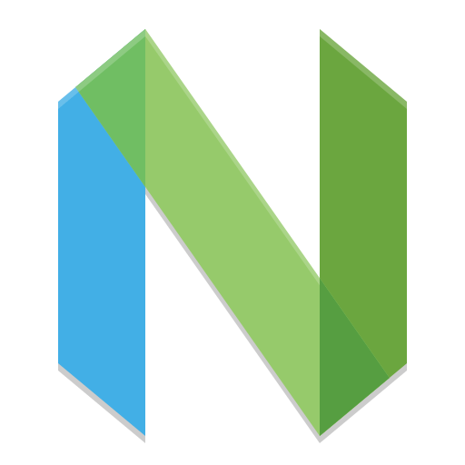

<h1 align="left">
  &emsp; 
  &nbsp; Hello there
</h1>

 

## 🧑‍💻 About me
I am an Informatik (Computer Science) student at TU Berlin. My coding journey started back in my childhood with C++ and C#, and that early curiosity never really left me. Lately, I've been diving deep into how things actually work under the hood. Scoring top grades (like 1.0 in Java and 1.3 in C and MIPS Assembly) wasn't just about passing exams for me; it made me realize how much I enjoy connecting the dots between bare-metal hardware and complex software.

## 🔭 Current Focus
Expanding my foundational Computer Science knowledge at TU Berlin.

## 🧭 Exploring Next
I have a deep fascination for the cyber world and am highly motivated to dive deep into Cybersecurity and Artificial Intelligence.

## 💡 Creative Edge
Beyond writing code, I enjoy blending technology with creativity by designing 3D models and animations in Cinema 4D.

## ⚙️ My Mindset
I am a highly persistent problem-solver. Whether it's debugging complex Assembly code, earning top grades in my university courses, or crafting 3D designs, I approach every challenge with dedication, patience, and a strong drive for excellence. I am currently looking for opportunities to apply my academic knowledge to real-world projects.

 

## 🔧 Skills & Tools
### Programming Languages

  &emsp;
  &emsp;
  &emsp;
  &emsp;
 &emsp;
 &emsp;

### Operating Systems

  &emsp;
  &emsp;

### Other Tools

 &emsp;
  &emsp;

 

## 🌐 Spoken Languages
* 🇩🇪 **German:** Fluent (C2)
* 🇬🇧 **English:** Intermediate (B2)
* 🇮🇷 **Persian:** Native

 

## 📫 Let's Connect!

   &emsp; &emsp;

  &emsp;

